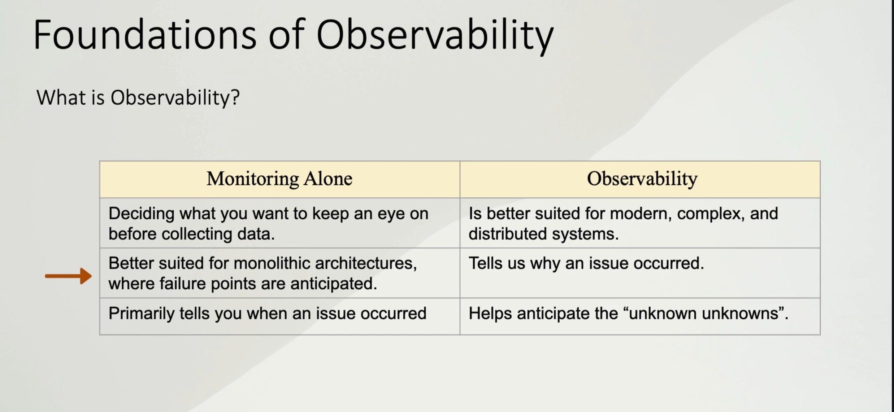

# Observability Strategy with Grafana

This guide presents a comprehensive observability strategy for E-Commerce applications and payment systems, using the Grafana stack on AWS.

## 1. Observability vs Monitoring

Historically, we were satisfied with knowing if the server was "on" or "off". In a modern distributed system (React in the client's browser + NestJS on the backend + Databases on AWS), that's not enough. We need to understand **why** things happen, not just **when**.

| Monitoring Alone | Observability |
|------------------|---------------|
| Deciding what to monitor before collecting data | Better suited for modern, complex, and distributed systems |
| Better for monolithic architectures where failure points are anticipated | Tells us **why** an issue occurred |
| Primarily tells you **when** an issue occurred | Helps anticipate the "unknown unknowns" |



> **Practical example:** While monitoring tells you "CPU is at 90%", observability allows you to ask "Which specific user caused that spike when trying to pay?".

## 2. The MELT Framework: Types of Telemetry Data

To avoid getting lost in a sea of data, we classify information into 4 essential types (MELT):


### 2.1 Metrics
Aggregated numerical data. Cheap to store.
- **Example:** "50 transactions per minute"

### 2.2 Events
Punctual state changes.
- **Example:** "Version v2.0 deployment successful"

### 2.3 Logs
Detailed textual records.
- **Example:** "VISA payment gateway connection error: Timeout"

### 2.4 Traces
The complete journey of a request through the system.
- **Example:** React (10ms) → NestJS (50ms) → Database (200ms)

## 3. Strategy by Layers

We don't measure everything the same way. We use different methodologies depending on the application layer:

.jpg)

### 3.1 UI Layer (React)
Here we care about the **user experience**. We use **Core Web Vitals**:

.jpg)

| Metric | Description |
|--------|-------------|
| **Largest Contentful Paint (LCP)** | Perceived page load speed |
| **First Input Delay (FID)** | Perceived responsiveness |
| **Cumulative Layout Shift (CLS)** | Visual stability |

### 3.2 Service Layer (NestJS)
We use the **RED Method** (Rate, Errors, Duration):

.jpg)

| Metric | Description |
|--------|-------------|
| **Rate** | How many requests do we receive? (throughput) |
| **Errors** | How many requests fail? (HTTP 500) |
| **Duration** | How long do they take? (latency) |

### 3.3 Infrastructure Layer (AWS EC2/ECS)
We use the **USE Method** (Utilization, Saturation, Errors):

| Metric | Description |
|--------|-------------|
| **Utilization** | CPU Usage %, Disk Space % |
| **Saturation** | Network queue length (Zero = Good) |
| **Errors** | Disk write errors (Zero = Good) |

## 4. Stack Architecture: How Does Data Flow?

For a typical stack (NestJS + React + Grafana), the collection architecture is hybrid. We'll use **Grafana Alloy** as the central brain ("router") that receives and fetches data.

### 4.1 Push Method (React → Alloy)

The React application lives in the user's browser. We can't connect to it; it must send us the data.


- **Tool:** Grafana Faro Web SDK
- **Flow:** React "pushes" errors and events to Alloy via TCP, UDP, or HTTP
- **Example:** Application sending metrics to StatsD, stored in Graphite

### 4.2 Scrape Method (Alloy → NestJS)

The NestJS backend exposes its metrics on a public URL (e.g., `/metrics`). Alloy periodically reads that URL.


- **Tool:** `nestjs-prometheus`
- **Flow:** Alloy "scrapes" NestJS counters every 15 seconds
- **Example:** Prometheus scraping metrics from the Backend Service

## 5. Practical Implementation: Payment System

### Business Premise
We want to detect which payment method is least used to evaluate whether it's worth maintaining, and monitor payment health in real-time.

### 5.1 Backend (NestJS)

We need a **Counter** type metric that increments +1 every time someone pays, labeling which method was used.

```typescript
// payment.service.ts
import { Injectable } from '@nestjs/common';
import { InjectMetric } from '@willsoto/nestjs-prometheus';
import { Counter } from 'prom-client';

@Injectable()
export class PaymentService {
  constructor(
    // Inject the counter defined in the module
    @InjectMetric('shop_payments_total')
    public paymentCounter: Counter<string>
  ) {}

  async processPayment(method: string, amount: number) {
    try {
      // ... payment logic with Stripe/PayPal...
      
      // HERE'S THE MAGIC!
      // Record success and method used (e.g., 'visa', 'paypal', 'crypto')
      this.paymentCounter.labels(method, 'success').inc();
    } catch (error) {
      // Record failure to alert if errors increase
      this.paymentCounter.labels(method, 'error').inc();
      throw error;
    }
  }
}
```

### 5.2 Frontend (React)

We want to know if the user had problems before reaching the backend (e.g., click on a broken button).

```typescript
// CheckoutButton.tsx
import { faro } from '@grafana/faro-web-sdk';

const handlePay = (method: string) => {
  // 1. Send a custom EVENT (RUM) to track click attempts
  faro.api.pushEvent('click_payment_button', {
    method: method,
    cart_value: '100.00'
  });
  
  try {
    // Call to backend
    api.pay(method);
  } catch (err) {
    // 2. Send the exact ERROR with context if JS fails
    faro.api.pushError(err, {
      context: { method: method, screen: 'checkout' }
    });
  }
};
```

## 6. PromQL Queries for Dashboards

Once the data is in Grafana (via Prometheus), we can answer key business questions.

### 6.1 Which payment method is least used today?

We use `bottomk` (bottom k elements) to find the lowest values, along with `increase` to see only the growth in the last 24 hours:

```promql
# Select the "Top 1" from bottom up (the worst)
# based on transaction increase in the last 24h
bottomk(1, sum by (method) (increase(shop_payments_total{status="success"}[24h])))
```

**Expected result:**
```
{method="amex"}: 5  # Only 5 payments with Amex today
```

> This allows you to make the decision to remove Amex if maintenance is costly.

### 6.2 Do we have latency in payments?

For this, we use **Traces (Tracing)**. If a payment takes 5 seconds, the Trace will tell you:

1. **Frontend:** 0.1s capturing the click
2. **Network:** 0.5s traveling to the server
3. **NestJS:** 4.4s waiting for database response ← Here's the problem!

## 7. Deployment on AWS

If the NestJS application already lives on AWS, there are three main strategies for deploying the observability stack.

### 7.1 Option A: "All-in-One" EC2 (Docker Compose)

**Ideal for:** Startups, MVPs, proof of concepts.

| Aspect | Detail |
|--------|--------|
| **Architecture** | Single EC2 instance hosts NestJS app + monitoring stack with containers |
| **Recommended Instance** | Minimum `t3.large` (2 vCPU, 8GB RAM) |
| **Configuration** | `docker-compose.yml` with: nestjs-app, alloy, loki, tempo, prometheus, grafana |
| **Pros** | Very cheap and easy if you already know Docker |
| **Cons** | If monitoring overloads, it can slow down your store ("noisy neighbor") |

> ⚠️ **Important:** A `t3.medium` (4GB) risks suffering "OOM Kills" (running out of memory).

### 7.2 Option B: AWS ECS Fargate (Sidecar Pattern)

**Ideal for:** Production, serious environments, scalability.

| Aspect | Detail |
|--------|--------|
| **Architecture** | NestJS as ECS service with Alloy as sidecar |
| **The Trick (Sidecar)** | In the same Task Definition, add Grafana Alloy as second container |
| **How it works** | NestJS sends traces to `localhost:4318`, Alloy forwards them to central server |
| **Pros** | No server management, Alloy scales automatically with the app |

### 7.3 Option C: Hybrid (App on AWS + Observability SaaS)

**Ideal for:** Cost efficiency and peace of mind. **Recommended for getting started.**

| Aspect | Detail |
|--------|--------|
| **Backend** | NestJS runs on EC2 or ECS on AWS |
| **Observability** | Grafana Cloud (Free Tier) |
| **Free Plan** | 50GB of logs/traces and 10k metrics |
| **Savings** | Avoid the cost of a `t3.large` (~$60/month) |

> **Why is this the best option to start with?**
> - Hosting Loki and Tempo requires fast disks and storage management
> - Grafana Cloud's Free Tier is more than enough for a medium-sized store
> - Just install Alloy on your AWS and configure it to send data to Grafana's cloud

## 8. Technology Stack Summary

| Component | Tool | Purpose |
|-----------|------|---------|
| **Collector** | Grafana Alloy | Central telemetry data router |
| **Metrics** | Prometheus | Time series database |
| **Logs** | Loki | Log storage and search |
| **Traces** | Tempo | Distributed tracing |
| **Frontend SDK** | Grafana Faro | RUM (Real User Monitoring) |
| **Backend SDK** | nestjs-prometheus | Metrics exposure in NestJS |
| **Visualization** | Grafana | Dashboards and alerts |

## References

- [Grafana Documentation](https://grafana.com/docs/)
- [Prometheus Documentation](https://prometheus.io/docs/)
- [Google SRE Book - The Four Golden Signals](https://sre.google/sre-book/monitoring-distributed-systems/)
- [Grafana Faro Web SDK](https://grafana.com/docs/grafana-cloud/monitor-applications/frontend-observability/)
