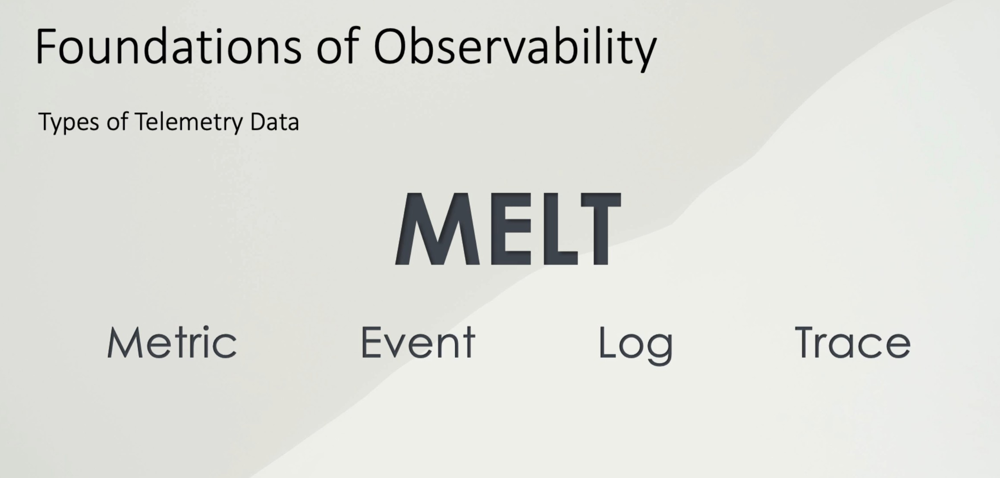
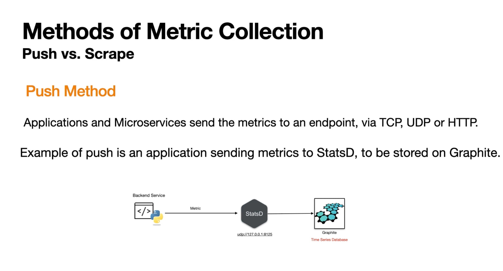
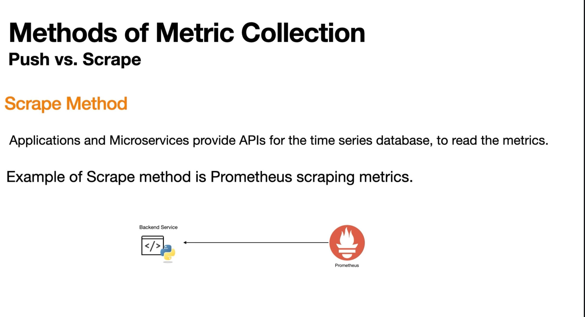

# Observability Strategy with Grafana

This guide presents a comprehensive observability strategy for E-Commerce applications and payment systems, using the Grafana stack on AWS.

## 1. Observability vs Monitoring

Historically, we were satisfied with knowing if the server was "on" or "off". In a modern distributed system (React in the client's browser + NestJS on the backend + Databases on AWS), that's not enough. We need to understand **why** things happen, not just **when**.

**Monitoring** is reactive and predefined. You decide upfront what to watch: CPU usage, memory, disk space, HTTP 500 errors. If something you didn't anticipate goes wrong, you're blind. Monitoring works well for monolithic systems where you can predict failure modes—the database runs out of connections, the disk fills up, the process crashes. These are known problems with known solutions.

**Observability** is exploratory and flexible. Instead of predefined dashboards, you collect rich telemetry data (metrics, logs, traces) and query it when problems occur. You can ask questions you didn't anticipate: "Why did checkout latency spike at 3pm for users in Argentina using Chrome on mobile?" You can correlate frontend errors with backend traces with infrastructure metrics to find root causes.

The difference matters because modern distributed systems fail in unexpected ways. A third-party payment gateway starts throttling requests. A new browser version handles cookies differently. A database index gets corrupted. You can't predict these failures, but with observability, you can investigate them.

| Monitoring Alone | Observability |
|------------------|---------------|
| Deciding what to monitor before collecting data | Better suited for modern, complex, and distributed systems |
| Better for monolithic architectures where failure points are anticipated | Tells us **why** an issue occurred |
| Primarily tells you **when** an issue occurred | Helps anticipate the "unknown unknowns" |

> **Practical example:** While monitoring tells you "CPU is at 90%", observability allows you to ask "Which specific user caused that spike when trying to pay?".

## 2. The MELT Framework: Types of Telemetry Data

To avoid getting lost in a sea of data, we classify information into 4 essential types (MELT). Each type serves a different purpose and has different cost/value tradeoffs. Understanding when to use each is critical for building an effective observability system.



### 2.1 Metrics

Metrics are aggregated numerical data points collected over time. They answer "how much" or "how many" questions: How many requests per second? What's the average response time? How much memory is used?

Metrics are cheap to store because they're pre-aggregated. Instead of storing every individual request, you store "50 requests happened in this minute with an average latency of 200ms". This compression makes metrics ideal for long-term storage and trend analysis. You can keep years of metric data without breaking the bank.

The tradeoff is loss of detail. Metrics tell you something is wrong (error rate spiked) but not which specific requests failed or why. That's where logs and traces come in.

**Common metric types:**
- **Counters**: Values that only go up (total requests, total errors). Use `rate()` or `increase()` to calculate per-second or per-period changes.
- **Gauges**: Values that can go up or down (current memory usage, active connections, queue depth).
- **Histograms**: Distribution of values (request latency percentiles). Critical for understanding user experience—averages hide outliers.

**Example:** "50 transactions per minute", "p99 latency is 500ms", "error rate is 0.5%"

### 2.2 Events

Events are discrete occurrences at a specific point in time. Unlike metrics (which are continuous), events are punctual: something happened right now. Deployments, configuration changes, scaling events, feature flag toggles, alerts firing.

Events are crucial for correlation. When you see a latency spike on your dashboard, the first question is "did anything change?". Overlaying deployment events on your metrics immediately shows if a new release caused the problem. This is why annotation layers in Grafana are so valuable.

Events are also the foundation of change management. Every deployment should emit an event with metadata: version, deployer, commit hash, environment. This creates an audit trail and enables fast rollback decisions.

**Example:** "Version v2.0 deployment successful", "Auto-scaling added 2 instances", "Feature flag 'new-checkout' enabled for 10% of users"

### 2.3 Logs

Logs are detailed textual records of what happened inside your application. They capture the narrative: request received, user authenticated, database queried, response sent. When something fails, logs tell you the story.

Logs are expensive. They're high-cardinality (every request is different), verbose (stack traces can be kilobytes), and hard to query efficiently. A busy service can generate gigabytes of logs per hour. This is why log management is a constant battle between verbosity (more context) and cost (storage and query performance).

Best practices for logging:
- **Use structured logging (JSON)**: Makes logs queryable. Instead of "User 123 logged in", emit `{"event": "login", "user_id": 123, "ip": "1.2.3.4"}`.
- **Include correlation IDs**: Every request should have a unique ID that appears in all logs for that request, enabling you to trace a request across services.
- **Log at appropriate levels**: DEBUG for development, INFO for normal operations, WARN for recoverable issues, ERROR for failures. Don't log at ERROR level for expected conditions.
- **Don't log sensitive data**: Passwords, tokens, credit card numbers should never appear in logs.

**Example:** "VISA payment gateway connection error: Timeout after 30s", "User 456 added item SKU-789 to cart", "Database query took 2.3s (slow query threshold: 1s)"

### 2.4 Traces

Traces capture the complete journey of a request through your distributed system. When a user clicks "Buy", that request might touch 10 different services: frontend, API gateway, authentication, inventory, payment, notification, etc. A trace links all these steps together with timing information.

Each trace consists of spans. A span represents a single operation: "call payment API", "query database", "serialize response". Spans are nested—a parent span contains child spans. The trace shows you the full tree: where time was spent, where errors occurred, where retries happened.

Traces are essential for distributed systems because they answer "where is the bottleneck?". If a request takes 5 seconds, the trace shows you that 4.5 seconds were spent waiting for the database. Without traces, you'd be guessing.

Traces are expensive to store (even more than logs) so sampling is common. You might trace 1% of requests in production, plus 100% of requests that error or exceed latency thresholds.

**Example trace breakdown:**
```
Total: 5.0s
├── Frontend: 100ms (button click → API call)
├── API Gateway: 50ms (routing, auth check)
├── Payment Service: 4.5s
│   ├── Validate request: 10ms
│   ├── Call Stripe API: 200ms
│   ├── Database write: 4.2s ← BOTTLENECK
│   └── Emit event: 90ms
└── Response: 50ms
```

## 3. Strategy by Layers

We don't measure everything the same way. Each layer of the application has different concerns and requires specific methodologies. The key is applying the right measurement approach at the right layer.

### 3.1 UI Layer (React) — Core Web Vitals

At the UI layer, we care about the **user experience**. Google's Core Web Vitals provide standardized metrics that directly correlate with how users perceive your application's performance.

**Largest Contentful Paint (LCP)** measures how long it takes for the largest visible content element (image, video, or text block) to render on screen. This is the user's perception of "when did the page load?". Target: under 2.5 seconds. A slow LCP means users stare at a blank or incomplete page, increasing bounce rates.

**First Input Delay (FID)** measures the time from when a user first interacts with your page (clicking a button, tapping a link) to when the browser can respond. This captures perceived responsiveness. Target: under 100ms. High FID means the browser is blocked by JavaScript execution, making the page feel unresponsive even if it looks loaded.

**Cumulative Layout Shift (CLS)** measures visual stability by tracking unexpected layout shifts during page load. Target: under 0.1. High CLS means elements jump around as the page loads, causing users to accidentally click wrong buttons or lose their reading position.

These metrics are collected via the Grafana Faro SDK running in the user's browser and pushed to Alloy.

### 3.2 Service Layer (NestJS) — RED Method

At the service layer, we use the **RED Method** (Rate, Errors, Duration), which is request-oriented and answers the question: "How is my service performing for users right now?"

**Rate (throughput)** measures requests per second hitting your service. This tells you demand levels and helps identify traffic patterns. A sudden spike might indicate a marketing campaign went live, a DDoS attack, or a retry storm from a failing downstream service. Track this per endpoint to identify which APIs are most utilized.

**Errors** measures the percentage of requests that fail (HTTP 5xx responses, exceptions, timeouts). This is your most critical health indicator. Even 1% error rate on a payment endpoint means 1 in 100 customers can't complete their purchase. Set alerts on error rate increases, not just absolute counts, since error count naturally rises with traffic.

**Duration (latency)** measures how long requests take to complete. Track percentiles (p50, p95, p99) rather than averages. A p99 of 5 seconds means 1% of your users wait 5+ seconds, even if your average looks healthy at 200ms. High latency on checkout endpoints directly impacts conversion rates.

The RED method is implemented by exposing a `/metrics` endpoint from NestJS using the `nestjs-prometheus` package, which Alloy scrapes every 15 seconds.

### 3.3 Infrastructure Layer (AWS EC2/ECS) — USE Method

At the infrastructure layer, we use the **USE Method** (Utilization, Saturation, Errors), which is resource-oriented and answers: "Are my resources healthy and sufficient?"

**Utilization** measures the percentage of time a resource is busy or the percentage of capacity being used. For CPU, track percentage across cores. For memory, track used vs available. For disk, track both space utilization and I/O utilization. High utilization (>80%) indicates you're approaching capacity limits and should scale or optimize.

**Saturation** measures the degree to which a resource has extra work queued that it can't service. For CPU, this is the run queue length. For network, this is socket buffer overflow or packet drops. For disk, this is I/O wait time. Any saturation indicates resource exhaustion—users experience this as latency spikes or timeouts. Zero saturation is ideal.

**Errors** measures resource-level failures: disk write errors, network packet errors, memory allocation failures. These often indicate hardware issues or misconfiguration. Unlike application errors, infrastructure errors are typically zero or catastrophic—any non-zero value warrants immediate investigation.

These metrics come from CloudWatch for AWS resources and are collected by Alloy for correlation with application-level data.

## 4. Stack Architecture: How Does Data Flow?

For a typical stack (NestJS + React + Grafana), the collection architecture is hybrid. We use **Grafana Alloy** as the central brain ("router") that receives and fetches data from various sources, then forwards it to the appropriate storage backends (Prometheus for metrics, Loki for logs, Tempo for traces).

Alloy replaces the need for multiple separate agents (Prometheus exporters, Promtail, OpenTelemetry Collector). It speaks multiple protocols and can transform, filter, and route data. This simplifies deployment and reduces resource overhead.

### 4.1 Push Method (React → Alloy)

The React application lives in the user's browser. We can't connect to it; it must send us the data. This is the fundamental challenge of frontend observability—you're running code on millions of devices you don't control.



The **Grafana Faro SDK** solves this by embedding a lightweight JavaScript agent in your React app. When the page loads, Faro starts collecting:
- **Performance data**: Core Web Vitals, resource timing, navigation timing
- **Errors**: JavaScript exceptions with full stack traces
- **User sessions**: Session IDs, user IDs (if provided), page views
- **Custom events**: Business events you explicitly push (add to cart, checkout, etc.)

Faro batches this data and sends it to Alloy via HTTP POST requests. Alloy then routes it:
- Errors and logs → Loki
- Performance metrics → Prometheus
- Session traces → Tempo

**Why push instead of scrape?** The browser can't expose a `/metrics` endpoint that Alloy could scrape. The browser initiates connections; it doesn't accept them. Push is the only option.

**Privacy considerations:** Faro collects data from real users. Be careful about what you include. Don't push PII (personal identifiable information) in custom events. Respect DNT (Do Not Track) headers if required by your privacy policy.

### 4.2 Scrape Method (Alloy → NestJS)

The NestJS backend runs on servers you control. Here, the **scrape model** works better: the application exposes a `/metrics` endpoint, and Alloy periodically fetches it.



The `nestjs-prometheus` package instruments your NestJS application to expose metrics in Prometheus format. When Alloy scrapes `/metrics`, it gets a text response like:

```
http_requests_total{method="GET", path="/api/products", status="200"} 15234
http_requests_total{method="POST", path="/api/checkout", status="500"} 12
http_request_duration_seconds_bucket{le="0.1"} 14000
http_request_duration_seconds_bucket{le="0.5"} 15000
http_request_duration_seconds_bucket{le="1.0"} 15200
```

**Why scrape instead of push?** Several advantages:
- **Pull-based discovery**: Alloy knows which services exist and can detect when they go down (scrape fails).
- **No lost data on restart**: If Alloy restarts, it just resumes scraping. With push, the application might buffer and lose data.
- **Rate control**: Alloy controls how often it scrapes (every 15s, 30s, etc.). With push, a buggy application might flood the collector.
- **Simpler application code**: The app just exposes metrics; it doesn't need to know where to send them.

The scrape interval (typically 15 seconds) determines your metric resolution. Shorter intervals give more granularity but cost more storage. 15 seconds is the sweet spot for most applications.

## 5. Practical Implementation: Payment System

Let's walk through a complete implementation for an e-commerce payment system. This example demonstrates how to instrument both backend and frontend to answer real business questions.

### Business Premise
We want to detect which payment method is least used to evaluate whether it's worth maintaining, and monitor payment health in real-time. This has direct business impact: if AMEX costs us $500/month in integration fees but only processes 5 transactions, we should consider dropping it.

### 5.1 Backend (NestJS)

We need a **Counter** type metric that increments +1 every time someone pays, labeling which method was used. Counters are perfect for this because:
- They only go up (you can't "un-pay")
- They survive restarts (Prometheus handles the monotonic counter logic)
- Labels let us slice by payment method, status, region, etc.

First, install the required packages:
```bash
npm install @willsoto/nestjs-prometheus prom-client
```

Register the Prometheus module and define your counter:

```typescript
// app.module.ts
import { Module } from '@nestjs/common';
import { PrometheusModule, makeCounterProvider } from '@willsoto/nestjs-prometheus';

@Module({
  imports: [
    PrometheusModule.register({
      path: '/metrics',
      defaultMetrics: { enabled: true },
    }),
  ],
  providers: [
    makeCounterProvider({
      name: 'shop_payments_total',
      help: 'Total number of payment attempts',
      labelNames: ['method', 'status'],
    }),
  ],
})
export class AppModule {}
```

Now use the counter in your payment service:

```typescript
// payment.service.ts
import { Injectable } from '@nestjs/common';
import { InjectMetric } from '@willsoto/nestjs-prometheus';
import { Counter } from 'prom-client';

@Injectable()
export class PaymentService {
  constructor(
    @InjectMetric('shop_payments_total')
    public paymentCounter: Counter<string>
  ) {}

  async processPayment(method: string, amount: number) {
    try {
      // ... payment logic with Stripe/PayPal...
      
      // Record success with method label (visa, paypal, crypto, etc.)
      this.paymentCounter.labels(method, 'success').inc();
    } catch (error) {
      // Record failure to alert if errors increase
      this.paymentCounter.labels(method, 'error').inc();
      throw error;
    }
  }
}
```

When you hit `/metrics`, you'll see:
```
shop_payments_total{method="visa",status="success"} 1523
shop_payments_total{method="visa",status="error"} 12
shop_payments_total{method="paypal",status="success"} 892
shop_payments_total{method="amex",status="success"} 5
```

### 5.2 Frontend (React)

We want to know if the user had problems before reaching the backend. Maybe the button doesn't work. Maybe JavaScript throws an error. Maybe the user abandons after clicking. Frontend instrumentation captures the full user journey.

First, install and configure Faro:

```typescript
// faro.ts
import { initializeFaro, getWebInstrumentations } from '@grafana/faro-web-sdk';

initializeFaro({
  url: 'https://alloy.yourcompany.com/collect',
  app: {
    name: 'ecommerce-frontend',
    version: '1.0.0',
    environment: 'production',
  },
  instrumentations: [
    ...getWebInstrumentations({
      captureConsole: true,
      captureConsoleDisabledLevels: [],
    }),
  ],
});
```

Then instrument your checkout button:

```typescript
// CheckoutButton.tsx
import { faro } from '@grafana/faro-web-sdk';

const handlePay = (method: string) => {
  // Track the click attempt - this fires even if the API call fails
  faro.api.pushEvent('click_payment_button', {
    method: method,
    cart_value: '100.00'
  });
  
  try {
    // Call to backend
    api.pay(method);
    
    // Track successful payment from frontend perspective
    faro.api.pushEvent('payment_success', { method });
  } catch (err) {
    // Send the exact error with context for debugging
    faro.api.pushError(err, {
      context: { method: method, screen: 'checkout' }
    });
    
    // Track failure as event too for easier querying
    faro.api.pushEvent('payment_failed', { 
      method, 
      error: err.message 
    });
  }
};
```

Now you can answer questions like:
- How many users clicked "Pay" but never made it to the backend? (click event without corresponding backend counter increment)
- Which payment methods have the highest frontend error rate?
- Are there browser-specific issues? (correlate with Faro's automatic browser metadata)

## 6. PromQL Queries for Dashboards

Once the data is in Grafana (via Prometheus), we can answer key business questions using PromQL. PromQL is Prometheus's query language—it looks intimidating at first but the core concepts are simple.

### 6.1 Which payment method is least used today?

We use `bottomk` (bottom k elements) to find the lowest values, along with `increase` to see only the growth in the last 24 hours.

**Why use `increase()` instead of the raw counter value?** Counter values always grow (they're cumulative). If we just looked at the raw number, AMEX might show 10,000 total transactions, but 9,995 of those could be from last year. `increase()` gives us the delta over a time period.

```promql
# Find the payment method with fewest successful transactions in last 24h
bottomk(1, sum by (method) (increase(shop_payments_total{status="success"}[24h])))
```

Breaking it down:
- `shop_payments_total{status="success"}` - filter to only successful payments
- `[24h]` - look at the last 24 hours of data
- `increase(...)` - calculate how much the counter increased in that period
- `sum by (method)` - group by payment method and sum (in case you have multiple instances)
- `bottomk(1, ...)` - return the 1 lowest value

**Expected result:**
```
{method="amex"}: 5  # Only 5 payments with Amex today
```

This directly informs business decisions: if AMEX processes 5 transactions/day but costs $500/month to maintain, that's $100 per transaction in overhead. Maybe it's not worth it.

### 6.2 What's the error rate by payment method?

```promql
# Error rate as percentage over last hour
sum by (method) (rate(shop_payments_total{status="error"}[1h])) 
/ 
sum by (method) (rate(shop_payments_total[1h])) 
* 100
```

This gives you percentage error rate per payment method. If VISA shows 0.5% but crypto shows 15%, you know where to focus debugging.

### 6.3 Do we have latency in payments?

For deep latency investigation, we use **Traces (Tracing)**. PromQL can tell you "average latency is 500ms" but traces tell you **why**.

If a payment takes 5 seconds, the trace shows the breakdown:

```
Request: POST /api/checkout
Total Duration: 5.0s

├── Span: http.request (100ms)
│   └── Routing, middleware, request parsing
├── Span: payment.validate (50ms)
│   └── Schema validation, fraud check
├── Span: payment.processStripe (300ms)
│   └── External API call to Stripe
├── Span: db.write (4.4s) ← BOTTLENECK FOUND
│   └── INSERT INTO transactions...
│   └── Query plan: Sequential scan (missing index!)
└── Span: event.emit (150ms)
    └── Publish to message queue
```

Without traces, you'd spend hours adding log statements and redeploying to find that missing database index. With traces, it's immediately visible.

### 6.4 Creating Alerts

Beyond dashboards, set up alerts for critical conditions:

```promql
# Alert if payment error rate exceeds 5% for 5 minutes
sum(rate(shop_payments_total{status="error"}[5m])) 
/ 
sum(rate(shop_payments_total[5m])) 
> 0.05
```

```promql
# Alert if no payments processed in last 10 minutes (during business hours)
sum(increase(shop_payments_total{status="success"}[10m])) == 0
```

## 7. Deployment on AWS

If the NestJS application already lives on AWS, there are three main strategies for deploying the observability stack. Each has different tradeoffs between cost, complexity, and operational burden.

### 7.1 Option A: "All-in-One" EC2 (Docker Compose)

**Ideal for:** Startups, MVPs, proof of concepts, development environments.

In this approach, you run everything on a single EC2 instance using Docker Compose: your NestJS application plus the entire observability stack (Alloy, Prometheus, Loki, Tempo, Grafana).

**The good:**
- Extremely simple to set up—one `docker-compose.yml` file
- Very cheap—single EC2 instance, no managed services
- Easy to understand—everything is in one place
- Great for learning and prototyping

**The bad:**
- Resource contention: if Grafana is running a heavy query, your application slows down
- Single point of failure: instance dies, everything dies
- Scaling limits: you can only scale vertically (bigger instance)
- Noisy neighbor problem: observability stack competes with your app for CPU/RAM

**Minimum requirements:**
- `t3.large` (2 vCPU, 8GB RAM) at minimum
- A `t3.medium` (4GB) will likely suffer OOM kills when Loki or Prometheus does compaction
- 100GB GP3 storage for logs and metrics retention
- Estimated cost: ~$70/month

**When to move away:** When your application traffic or observability data volume outgrows the single instance, or when you need high availability.

### 7.2 Option B: AWS ECS Fargate (Sidecar Pattern)

**Ideal for:** Production workloads, teams already using ECS, applications that need to scale.

In the sidecar pattern, Grafana Alloy runs as a container alongside your NestJS container in the same ECS Task Definition. They share a network namespace, so your app sends traces to `localhost:4318` and Alloy forwards them to a central observability backend.

**The good:**
- No servers to manage—Fargate is serverless containers
- Automatic scaling—if your app scales to 10 instances, you get 10 Alloy sidecars
- Resource isolation—Alloy has its own CPU/memory allocation
- Production-ready patterns

**The bad:**
- More complex ECS Task Definitions
- Still need somewhere to run Grafana/Prometheus/Loki (or use managed services)
- Costs more than a single EC2 instance

**Architecture:**
```
┌─────────────────────────────────────┐
│ ECS Task                            │
│  ┌─────────────┐  ┌──────────────┐  │
│  │ NestJS App  │  │ Grafana Alloy│  │
│  │             │──│ (sidecar)    │  │
│  │ :3000       │  │ :4318        │  │
│  └─────────────┘  └──────────────┘  │
└─────────────────────────────────────┘
           │
           ▼
    ┌──────────────┐
    │ Grafana Cloud│
    │ or self-hosted│
    └──────────────┘
```

### 7.3 Option C: Hybrid (App on AWS + Observability SaaS)

**Ideal for:** Cost efficiency and peace of mind. **This is our recommended starting point.**

Your application runs on AWS (EC2, ECS, whatever you prefer), but the observability backend runs on Grafana Cloud's free tier. You only deploy Grafana Alloy on AWS to collect and forward data.

**Why this is the best option to start with:**

1. **Grafana Cloud Free Tier is generous:** 50GB logs/traces, 10k metrics series, 14-day retention. This covers most small-to-medium applications.

2. **No storage management:** Running Loki and Tempo yourself means managing disk I/O, compaction, retention policies, and storage scaling. Grafana Cloud handles all of this.

3. **No upgrades to worry about:** Grafana releases monthly updates. On Cloud, you get them automatically. Self-hosted, you need to plan and execute upgrades.

4. **Lower AWS costs:** You can run your app on a small instance since you're not co-locating the observability stack. A `t3.small` for your app + free Grafana Cloud beats a `t3.large` running everything.

5. **Still have escape hatch:** All your data is in standard formats (Prometheus, Loki, Tempo). If you outgrow the free tier or need on-prem, you can self-host with the same queries and dashboards.

**Setup summary:**
1. Sign up for Grafana Cloud (free)
2. Deploy Alloy on your AWS infrastructure
3. Configure Alloy to push to Grafana Cloud endpoints
4. Build dashboards in cloud Grafana

**Estimated cost:** AWS compute for Alloy (~$10-20/month) + Grafana Cloud free tier = minimal.

## 8. Technology Stack Summary

Here's what each component does and why we chose it:

| Component | Tool | Purpose |
|-----------|------|---------|
| **Collector** | Grafana Alloy | Central telemetry data router. Replaces Prometheus exporters, Promtail, OpenTelemetry Collector with a single binary. Handles scraping, receiving, transforming, and forwarding all telemetry types. |
| **Metrics** | Prometheus | Time series database optimized for metrics. Efficient storage, powerful query language (PromQL), battle-tested at scale. Industry standard for cloud-native monitoring. |
| **Logs** | Loki | Log aggregation system designed by Grafana Labs. Unlike Elasticsearch, Loki only indexes metadata (labels), making it much cheaper to run. Queries use LogQL, which is similar to PromQL. |
| **Traces** | Tempo | Distributed tracing backend. Stores traces in object storage (S3) for cost efficiency. Integrates with Grafana for trace visualization and correlation with logs/metrics. |
| **Frontend SDK** | Grafana Faro | Real User Monitoring (RUM) SDK for web applications. Captures Core Web Vitals, JavaScript errors, user sessions, and custom events. Lightweight and privacy-conscious. |
| **Backend SDK** | nestjs-prometheus | Prometheus metrics integration for NestJS. Exposes `/metrics` endpoint with automatic HTTP request instrumentation plus custom business metrics. |
| **Visualization** | Grafana | Dashboard and alerting platform. Connects to all data sources (Prometheus, Loki, Tempo) and provides unified querying, visualization, and alerting. The UI for your observability stack. |

## References

- [Grafana Documentation](https://grafana.com/docs/)
- [Prometheus Documentation](https://prometheus.io/docs/)
- [Google SRE Book - The Four Golden Signals](https://sre.google/sre-book/monitoring-distributed-systems/)
- [Grafana Faro Web SDK](https://grafana.com/docs/grafana-cloud/monitor-applications/frontend-observability/)
- [RED Method by Tom Wilkie](https://www.weave.works/blog/the-red-method-key-metrics-for-microservices-architecture/)
- [USE Method by Brendan Gregg](https://www.brendangregg.com/usemethod.html)
